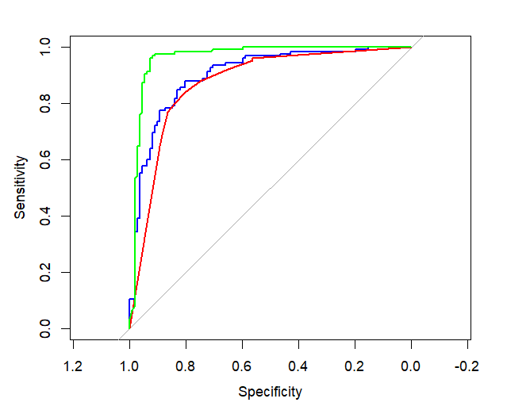

# Heart Disease Prediction using Machine Learning in R

This project compares performance of multiple ML models for heart disease prediction and identifies important clinical predictors.

## 📌 Objective

Predict whether a patient has heart disease using clinical parameters.

## 📊 Dataset

1190 patient records with 12 clinical features: - Age, Sex, Chest Pain
Type - Blood Pressure, Cholesterol - ECG, Max Heart Rate - Exercise
Angina, Oldpeak, ST Slope - Target (0 = No disease, 1 = Disease)

## ⚙️ Feature Engineering

Created new feature: risk_score = resting_bp_s × cholesterol

## 🧠 Models Used

1.  Logistic Regression
2.  Decision Tree
3.  Random Forest

## 📈 Model Performance

| Model               | Accuracy  | AUC      |
|---------------------|-----------|----------|
| Logistic Regression | 84%       | 0.90     |
| Decision Tree       | 82%       | 0.87     |
| Random Forest       | **94.5%** | **0.96** |

## 🔍 Important Features (Random Forest)

-   ST slope
-   Chest pain type
-   Max heart rate
-   Oldpeak
-   Risk score

## 🖼️ Outputs

### Decision Tree

### Random Forest Feature Importance

### ROC Curve

## 🛠️ Tools

-   R
-   caret
-   rpart
-   randomForest
-   pROC

## 🧾 Conclusion

Random Forest performed the best with an AUC of 0.96 and high accuracy, making it a strong model for clinical heart disease prediction. Feature importance revealed clinically relevant predictors like ST slope, chest pain type, and risk score.
